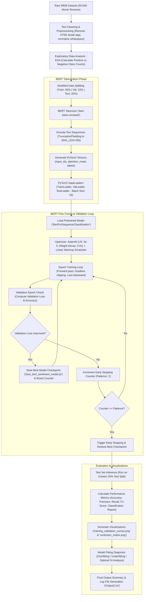

# BERT Sentiment Analysis on IMDB Movie Reviews

A complete, production-ready, beginner-friendly Natural Language Processing (NLP) text classification project that fine-tunes a pretrained **BERT** model (`bert-base-uncased`) using **PyTorch** and **Hugging Face Transformers** to classify IMDB movie reviews into **Positive** or **Negative** sentiments.

---

## 📌 Project Overview

This project implements an end-to-end deep learning pipeline for binary sentiment analysis on the **IMDB Movie Reviews dataset** (50,000 labeled reviews). It incorporates modern NLP best practices, including:
- **Transfer Learning** with Bidirectional Encoder Representations from Transformers (**BERT**).
- **Stratified Data Splitting** into Training, Validation, and Test sets.
- **Contextual Tokenization** with `[CLS]` and `[SEP]` tokens, `input_ids`, and `attention_mask` tensors.
- **Early Stopping & Weight Checkpointing** based on validation loss to prevent overfitting.
- **Automated Visualization** of Loss/Accuracy training curves and Seaborn Confusion Matrix heatmaps.
- **Comprehensive Evaluation** including Accuracy, Precision, Recall, F1-Score, Classification Reports, and automated Overfitting/Underfitting diagnostics.

---

## 🔄 End-to-End Pipeline Flowchart



---

## 📁 Repository Structure

```text
Txt Classification/
├── config.py                  # Centralized configuration & hyperparameter settings
├── dataset.py                 # Data loading, cleaning, EDA, stratified split, PyTorch Dataset
├── model.py                   # Hugging Face BERT model builder & tokenizer loader
├── trainer.py                 # Fine-tuning loop, validation step, early stopping logic
├── evaluate.py                # Test set evaluation, metrics, training curves, confusion matrix
├── main.py                    # Executable command-line pipeline entrypoint
├── sentiment_analysis_bert.ipynb # Self-contained step-by-step Jupyter Notebook
├── requirements.txt           # Required Python packages
├── README.md                  # Detailed project documentation & instructions
├── best_bert_sentiment_model.pt # Saved checkpoint of the best fine-tuned model
├── training_validation_curves.png # Generated loss and accuracy visualization plot
└── confusion_matrix.png       # Generated seaborn confusion matrix heatmap
```

### Module Breakdown

| File | Purpose |
|:---|:---|
| **`config.py`** | Centralizes all parameters (`SAMPLE_MODE`, `SAMPLE_SIZE`, `BERT_MODEL_NAME`, `MAX_LEN`, `BATCH_SIZE`, `EPOCHS`, `LEARNING_RATE`, `PATIENCE`, compute device auto-detection for MPS/CUDA/CPU). |
| **`dataset.py`** | Loads IMDB data via Hugging Face `datasets`, cleans HTML tags (`<br />`), computes EDA class balances, splits data into 65% Train / 15% Val / 20% Test, and builds PyTorch `IMDBDataset`. |
| **`model.py`** | Initializes Hugging Face `BertForSequenceClassification.from_pretrained('bert-base-uncased', num_labels=2)` and transfers model to active compute device. |
| **`trainer.py`** | Manages `AdamW` optimization, linear scheduler warmup, gradient clipping (`max_norm=1.0`), epoch training/validation loops, and `EarlyStopping`. |
| **`evaluate.py`** | Evaluates final test predictions, computes classification metrics, plots training curves & confusion matrix, and generates overfitting/underfitting diagnostic reports. |
| **`main.py`** | Main entrypoint supporting CLI arguments (`--full`, `--sample_size`, `--epochs`, `--batch_size`, `--lr`, `--model`). |
| **`sentiment_analysis_bert.ipynb`** | A self-contained Jupyter Notebook formatted cleanly with Markdown explanations and executable cells. |

---

## ⚙️ Requirements & Installation

### Prerequisites
- **Python 3.8+**
- macOS (Apple Silicon MPS hardware acceleration supported), Linux, or Windows (CUDA supported).

### Setup Instructions

1. **Clone or navigate to the project directory**:
   ```bash
   cd "/Users/srinivasa/Desktop/Txt Classification"
   ```

2. **Activate the virtual environment**:
   - On macOS/Linux:
     ```bash
     source .venv/bin/activate
     ```
   - On Windows (PowerShell):
     ```powershell
     .\.venv\Scripts\Activate.ps1
     ```

3. **Install dependencies**:
   ```bash
   pip install -r requirements.txt
   ```

---

## 🚀 How to Run the Project

### 1. Run in Sample Mode (Fast Test on 2,000 Reviews)
Runs the end-to-end pipeline on a smaller balanced subset of 2,000 reviews for rapid testing (~1-2 minutes):
```bash
python main.py
```

### 2. Run on the Complete 50,000 IMDB Dataset
Fine-tunes BERT on the complete 50,000 IMDB Movie Reviews dataset:
```bash
python main.py --full
```

### 3. Save Output Logs directly to a File
To execute the pipeline while viewing progress and saving the output log to a text file:
```bash
python main.py --full 2>&1 | tee Output2.txt
```

### 4. Run with Custom Command-Line Arguments
You can easily pass custom hyperparameters directly via CLI:
```bash
python main.py --full --epochs 4 --batch_size 16 --lr 2e-5 --model bert-base-uncased
```

Available CLI Flags:
- `--full` : Run on complete 50,000 dataset (default is sample mode).
- `--sample_size` : Number of reviews when running in sample mode (default: `2000`).
- `--epochs` : Maximum training epochs (default: `4`).
- `--batch_size` : DataLoader batch size (default: `16`).
- `--lr` : Learning rate (default: `2e-5`).
- `--model` : Hugging Face model checkpoint (default: `bert-base-uncased`).

### 5. Run via Jupyter Notebook
Open the interactive notebook in Jupyter Lab, Jupyter Notebook, or VS Code:
```bash
jupyter notebook sentiment_analysis_bert.ipynb
```
Click **Run All Cells** to execute the pipeline step-by-step with inline figures.

---

## 🎛️ How to Customize Configuration (`config.py`)

You can also customize the project default settings directly inside `config.py`:

```python
# Toggle Sample Mode (True for subset testing, False for full dataset)
SAMPLE_MODE = False

# Number of sample reviews for fast execution
SAMPLE_SIZE = 2000

# Model choice (Easily swap to DistilBERT or RoBERTa)
BERT_MODEL_NAME = 'bert-base-uncased'

# Max token length (BERT supports up to 512)
MAX_LEN = 256

# Hyperparameters
BATCH_SIZE = 16
EPOCHS = 4
LEARNING_RATE = 2e-5
PATIENCE = 2  # Early stopping patience
```

---

## 📊 Sample Output Format

When you run `main.py`, the system outputs:

```text
============================================================
        BERT SENTIMENT ANALYSIS PIPELINE INITIALIZATION
============================================================
Mode          : Sample Mode (2000 samples)
BERT Model    : bert-base-uncased
Batch Size    : 16
Max Epochs    : 4
Learning Rate : 2e-05
Device        : mps
============================================================
Loading IMDB Movie Reviews dataset...

============================================================
           EXPLORATORY DATA ANALYSIS (EDA)
============================================================
Total Reviews Analyzed      : 2,000
Number of Positive Reviews (1): 1,000 (50.00%)
Number of Negative Reviews (0): 1,000 (50.00%)
============================================================

Data Split Summary:
  Training Set   : 1,300 samples (65.0%)
  Validation Set : 300 samples (15.0%)
  Test Set       : 400 samples (20.0%)

============================================================
                STARTING BERT MODEL FINE-TUNING
============================================================
Epoch 1/4 -> Train Loss: 0.5284, Train Acc: 71.92% | Val Loss: 0.4400, Val Acc: 80.67%
Epoch 2/4 -> Train Loss: 0.2694, Train Acc: 89.85% | Val Loss: 0.2746, Val Acc: 90.33%
Epoch 3/4 -> Train Loss: 0.1254, Train Acc: 96.08% | Val Loss: 0.3349, Val Acc: 90.00%
Epoch 4/4 -> Early stopping triggered. Restoring best model weights (Epoch 2).

============================================================
                FINAL MODEL EVALUATION SUMMARY
============================================================
Model          : BERT (bert-base-uncased)
Dataset        : IMDB Movie Reviews
Task           : Binary Sentiment Classification
Test Accuracy  : 87.75%
Precision      : 0.8647
Recall         : 0.8950
F1-Score       : 0.8796

--- Classification Report ---
              precision    recall  f1-score   support

    Negative     0.8912    0.8600    0.8753       200
    Positive     0.8647    0.8950    0.8796       200

    accuracy                         0.8775       400
   macro avg     0.8780    0.8775    0.8775       400
weighted avg     0.8780    0.8775    0.8775       400

============================================================
          MODEL FITTING DIAGNOSTIC ANALYSIS
============================================================
Final Epoch Training Loss   : 0.0559
Final Epoch Validation Loss : 0.3807
Final Epoch Train Accuracy  : 98.69%
Final Epoch Val Accuracy    : 89.33%

Status: SLIGHT OVERFITTING
Diagnosis:
The model shows signs of SLIGHT OVERFITTING. The training loss is lower than the validation loss. Early stopping prevented severe overfitting and restored the best checkpoint from Epoch 2.
============================================================
```

---

## 📈 Visualizations Generated

- **`training_validation_curves.png`**: Side-by-side plots of Training vs Validation Loss and Training vs Validation Accuracy across epochs.
- **`confusion_matrix.png`**: Seaborn Heatmap displaying True Positives, True Negatives, False Positives, and False Negatives with count and percentage annotations.

---

## 💡 License & Acknowledgments

- **Dataset**: Stanford IMDB Movie Reviews Dataset.
- **Pretrained Model**: Hugging Face Transformers (`bert-base-uncased`).
- **Framework**: PyTorch.
